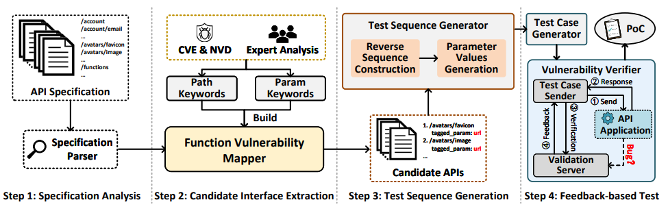

# VoAPI2

A vulnerability-oriented API inspection framework designed to directly expose vulnerabilities in RESTful APIs, based on our observation that the type of vulnerability hidden in an API interface is strongly associated with its functionality.

## Overview of VoAPI2



VOAPI2 first analyzes the API specification and identifies semantic keywords associated with potentially weak functions within the API specification. It then integrates a suitable corpus and employs a stateful request sequence that aligns with the execution context of the corresponding functions. By utilizing inspection payloads tailored to different vulnerability types, VOAPI2 can effectively assess these candidate functions for potential vulnerabilities.

## Research paper

We present our approach in the following research paper accepted at the 33rd USENIX Security Symposium:

**Vulnerability-oriented Testing for RESTful APIs** 

## New Feature
We've improved our API Specification Parser to enable VoAPI to test more API products.

## How To Use VoAPI2
### Prerequisites
Install [Python 3.8.10](https://www.python.org/downloads/) and
[.NET 6.0](https://dotnet.microsoft.com/download/dotnet-core?utm_source=getdotnetcorecli&utm_medium=referral), for your appropriate OS.

### 1. Parse OpenAPI Spec
Use VoAPISpecParser.py to parse API documents into our custom restler_compile file.

```
$ python VoAPISpecParser.py -h
usage: VoAPISpecParser.py [-h] --openapi OPENAPI [--voapi_compiler_dir VOAPI_COMPILER_DIR] [--voapi_compiler_output_dir VOAPI_COMPILER_OUTPUT_DIR]
                          [--restler_compile_file_path RESTLER_COMPILE_FILE_PATH] [--recompile]

optional arguments:
  -h, --help            show this help message and exit
  --openapi OPENAPI     OpenAPI Specification File Path
  --voapi_compiler_dir VOAPI_COMPILER_DIR
                        VoAPICompiler SourceCode Dir
  --voapi_compiler_output_dir VOAPI_COMPILER_OUTPUT_DIR
                        VoAPICompiler Bin Dir
  --restler_compile_file_path RESTLER_COMPILE_FILE_PATH
                        Restler Compile File Path
  --recompile           Whether Need Recompile VoAPICompiler, Default: False
```

### 2. Start Vulnerablity Verifier
Use VoAPIVerification.py and VoAPIVerificationForHttps.py to start vulnerablity verifier.

```
$ python VoAPIVerification.py -h    
usage: VoAPIVerification.py [-h] --verification_server_ip VERIFICATION_SERVER_IP --verification_server_port VERIFICATION_SERVER_PORT --output OUTPUT

optional arguments:
  -h, --help            show this help message and exit
  --verification_server_ip VERIFICATION_SERVER_IP
                        Verification Server Ip
  --verification_server_port VERIFICATION_SERVER_PORT
                        Verification Server Port
  --output OUTPUT       Output Dir Absolute Path
```

```
$ python VoAPIVerificationForHttps.py -h
usage: VoAPIVerificationForHttps.py [-h] --verification_server_ip VERIFICATION_SERVER_IP --verification_server_port_for_https
                                    VERIFICATION_SERVER_PORT_FOR_HTTPS --output OUTPUT --certificate_dir CERTIFICATE_DIR

optional arguments:
  -h, --help            show this help message and exit
  --verification_server_ip VERIFICATION_SERVER_IP
                        Verification Server Ip
  --verification_server_port_for_https VERIFICATION_SERVER_PORT_FOR_HTTPS
                        Verification Server Port For HTTPS
  --output OUTPUT       Output Dir Absolute Path
  --certificate_dir CERTIFICATE_DIR
                        Certificate Dir Absolute Path
```

### 3. Test API Service
Use VoAPITest.py to test API service.

```
$ python VoAPITest.py -h
usage: VoAPITest.py [-h] [--openapi OPENAPI] [--restler_compile RESTLER_COMPILE] [--verification_server_ip VERIFICATION_SERVER_IP]
                    [--verification_server_port VERIFICATION_SERVER_PORT] [--verification_server_port_for_https VERIFICATION_SERVER_PORT_FOR_HTTPS]   
                    [--baseurl BASEURL] [--output OUTPUT] [--upload_payloads_dir UPLOAD_PAYLOADS_DIR] [--api_header_file API_HEADER_FILE]
                    [--api_content_type API_CONTENT_TYPE] [--api_param_file API_PARAM_FILE] [--api_validity_file API_VALIDITY_FILE]
                    [--api_template_file API_TEMPLATE_FILE] [--no_get_producer] [--open_isrequired] [--need_trigger]

optional arguments:
  -h, --help            show this help message and exit
  --openapi OPENAPI     OpenAPI File Path For Resolve "multipart/form-data" to Support Upload API
  --restler_compile RESTLER_COMPILE
                        RESTler Compile File Path
  --verification_server_ip VERIFICATION_SERVER_IP
                        Verification Server IP
  --verification_server_port VERIFICATION_SERVER_PORT
                        Verification Server Port
  --verification_server_port_for_https VERIFICATION_SERVER_PORT_FOR_HTTPS
                        Verification Server Port For Https
  --baseurl BASEURL     Target API Service Base Url
  --output OUTPUT       Output Dir Absolute Path
  --upload_payloads_dir UPLOAD_PAYLOADS_DIR
                        Upload Payloads Dir Absolute Path
  --api_header_file API_HEADER_FILE
                        API Header File for Using API
  --api_content_type API_CONTENT_TYPE
                        API Request Content-Type Header for Using API
  --api_param_file API_PARAM_FILE
                        API Param File for Using API
  --api_validity_file API_VALIDITY_FILE
                        API Validity Str File for Judging API Request Success or Not
  --api_template_file API_TEMPLATE_FILE
                        API Template File for Adding API
  --no_get_producer     Get Method Can not be Producer, Default: False
  --open_isrequired     Whether Open Param isRequired Option or not, Default: False
  --need_trigger        Whether Need Trigger API to Trigger Vul, Default: False
```

## Example
We use [Appwrite 0.9.3](https://github.com/appwrite/appwrite/tree/0.9.3) as a test case to illustrate the usage of VoAPI2:

### 1. Parse Appwrite OpenAPI Specification:

```
python VoAPISpecParser.py --openapi D:\workspace\NSSL\VoAPI2\AppwriteExample\APISpec-appwrite.json --voapi_compiler_dir D:\workspace\NSSL\VoAPI2\VoAPICompiler --voapi_compiler_output_dir D:\workspace\NSSL\VoAPI2\VoAPICompilerBin --restler_compile_file_path D:\workspace\NSSL\VoAPI2\APIInfo-appwrite.txt --recompile
```

After this step, we can get **APIInfo-appwrite.txt**

### 2. Start Vulnerablity Verifier

Start HTTP Vulnerablity Verifier:
```
python VoAPIVerification.py --verification_server_ip 192.168.202.1 --verification_server_port 4444 --output D:\workspace\NSSL\VoAPI2\output
```

Start HTTPS Vulnerablity Verifier:
```
python VoAPIVerificationForHttps.py --verification_server_ip 192.168.202.1 --verification_server_port_for_https 4445 --output D:\workspace\NSSL\VoAPI2\output --certificate_dir D:\workspace\NSSL\VoAPI2\VoAPIVerificationCert
```

### 3. Test Appwrite API Service

```
python VoAPITest.py --output D:\workspace\NSSL\VoAPI2\output --openapi D:\workspace\NSSL\VoAPI2\AppwriteExample\APISpec-appwrite.json --restler_compile D:\workspace\NSSL\VoAPI2\AppwriteExample\APIInfo-appwrite.txt --verification_server_ip 192.168.202.1 --verification_server_port 4444 --verification_server_port_for_https 4445 --baseurl http://192.168.202.248/v1 --upload_payloads_dir D:\workspace\NSSL\VoAPI2\APIUploadPayloads --api_header D:\workspace\NSSL\VoAPI2\AppwriteExample\Header-appwrite.json --api_param D:\workspace\NSSL\VoAPI2\AppwriteExample\Param-appwrite.json
```
